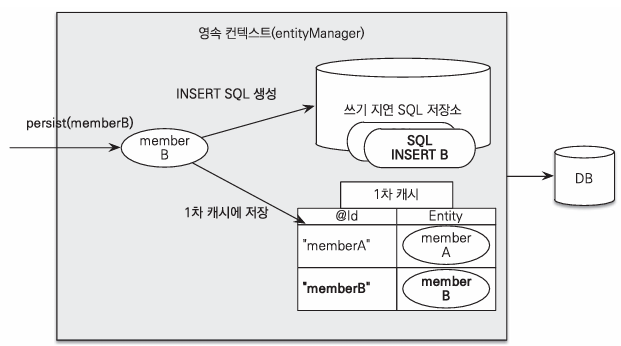
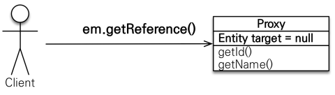
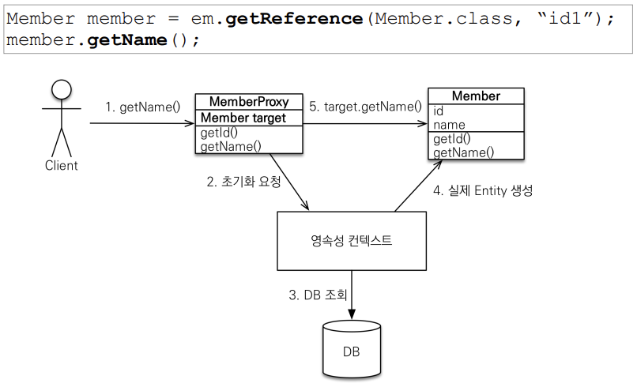
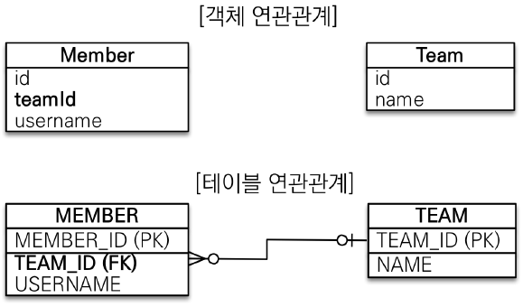
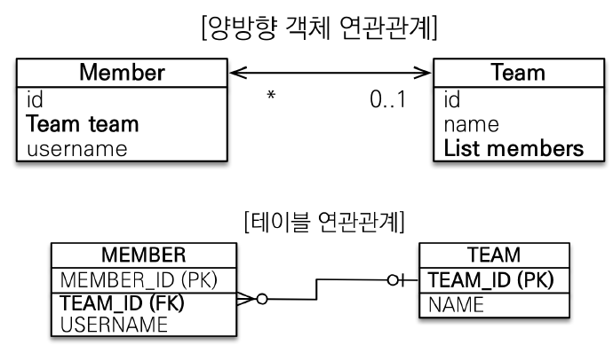

## JPA란 무엇인가?

JPA(Java Persistence API)는 자바 애플리케이션에서 관계형 데이터베이스를 관리하고 조작하기 위한 표준 API다. 객체-관계 매핑(ORM)을 통해 객체 지향 프로그래밍 언어인 자바와 관계형 데이터베이스 사이의 불일치를 해결한다.

## Entity, Entity Manager

### Entity

- **Entity**는 데이터베이스 테이블에 대응하는 자바 클래스다.
- `@Entity` 어노테이션을 사용하여 지정한다.
- 클래스의 각 필드는 테이블의 열과 대응되며 `@Column` 어노테이션을 사용해 명시적으로 매핑할 수 있다.

  ```java
  @Entity
  @Table(name = "users")
  public class User {
      @Id
      @GeneratedValue(strategy = GenerationType.IDENTITY)
      private Long id;

      @Column(name = "username")
      private String username;

      @Column(name = "password")
      private String password;

      // Getters and Setters
  }
  ```

### Entity Manager

- **Entity Manager**는 JPA에서 엔티티를 관리하는 인터페이스다.
- 데이터베이스 연산을 처리하며 엔티티의 생명주기를 관리한다.
- `EntityManager Factory`를 통해 생성된다.
- 한 번 생성할 때 드는 비용이 적다.
  ```java
  EntityManagerFactory emf = Persistence.createEntityManagerFactory("example-unit");
  EntityManager em = emf.createEntityManager();
  em.getTransaction().begin();
  User user = em.find(User.class, 1L);
  em.getTransaction().commit();
  em.close();
  emf.close();
  ```

## JPA에서 자주 사용되는 어노테이션(@)

- `@Entity`: 클래스를 엔티티로 지정한다.
- `@Table`: 엔티티와 매핑할 테이블을 지정한다.
- `@Id` : 기본 키를 지정한다.
- `@GeneratedValue` : 기본 키 생성 전략을 지정한다.
- `@Column` : 필드와 열을 매핑한다.
- `@OneToOne` , `@OnToMany`, `ManyToOne`, `@ManyToMany` : 엔티티 간의 관계를 매핑한다.
- `@JoinColumn` : 외래 키를 매핑한다.
- `@Transient` : 특정 필드를 영속성 관리하지 않도록 지정한다.

## @Transactional

- 메서드나 클래스에 트랜잭션을 적용하기 위해 사용한다.
- 트랜잭션의 범위를 설정하여 원자성을 보장한다.
  ```java
  @Transactional
  public void createUser(User user) {
      entityManager.persist(user);
  }
  ```

## 영속성 컨텍스트란?

- **영속성 컨텍스트**는 엔티티를 영구 저장소에 저장하는 환경이다.
- 엔티티 매니저가 관리하는 엔티티 인스턴스들이 영속성 컨텍스트에 의해 관리된다.
- 동일한 영속성 컨텍스트 내에서는 동일한 엔티티 인스턴스를 보장한다.
- 엔티티가 영속성 컨텍스트에 포함되면 해당 엔티티는 관리상태가 되어 변경사항이 자동으로 데이터베이스에 반영된다.
  

## 즉시 로딩, 지연 로딩

- 즉시 로딩은 데이터 조회 시 연관된 데이터까지 한 번에 불러오고, 지연로딩은 필요한 시점에 연관된 데이터를 불러온다.

### Fetch Type

- JPA가 하나의 Entity를 조회할 때 연관관계에 있는 객체들을 어떻게 가져올 것인지를 나타내는 설정값이다.
  > (default) `@xxToOne`은 **EAGER**, `@xxToMany`는 **LAZY**

### 즉시 로딩(Eager Loading)

- 엔티티가 조회될 때 연관된 엔티티들도 함께 조회된다.
- 성능에 부담을 줄 수 있으나 즉시 필요한 데이터를 빠르게 조회할 수 있다.

  ```java
  @Entity
  public class Member {

      @Id @GeneratedValue
      private Long id;
      private String username;

      @ManyToOne(fetch = FetchType.EAGER) //Team을 조회할 때 즉시로딩을 사용하겠다!
      @JoinColumn(name = "team_id")
      Team team;
  }

  @Entity
  public class Team {

      @Id @GeneratedValue
      private Long id;
      private String teamname;
  }
  ```

- JPQL로 Member 1건 조회

```java
Member findMember = em.createQuery("select m from Member m", Member.class).getSingleResult();
```

- Member 조회 시점에 바로 Team까지 불러오는 쿼리를 날려 한꺼번에 데이터를 불러온다.

### 지연 로딩(Lazy Loading)

- 실제로 연관된 엔티티가 필요할 때 조회된다.
- 성능을 최적화할 수 있으나, 사용 시점에 데이터베이스 조회가 발생한다.
  ```java
  ...
  @ManyToOne(fetch = FetchType.LAZY)
  ...
  Member findMember = em.createQuery("select m from Member m", Member.class).getSingleResult();
  ```
- Member를 조회하는 시점이 아닌 Team을 사용하는 시점에 쿼리가 나간다.

### 만약 member와 연관된 Team이 1000개라면?

- 즉시로딩에서는 member 조회를 할 때 Team조회 SQL쿼리가 1000개가 나갈 수 있다. 따라서 가급적이면 기본적으로 지연로딩 사용하는 것이 좋다.

## 프록시

- **프록시(Proxy)**는 진짜 객체 대신에 가짜 객체로서 진짜를 대신해준다.
- Hibernate는 지연 로딩을 구현하기 위해 프록시를 사용한다.

### 사용방법

- EntityManager에서 `getReference()`를 사용하여 진짜 객체를 참조하여 가짜 객체를 만든다.
- 진짜 객체를 호출할 때는 `em.find()`를 사용하지만, 가짜 객체는 `em.getReference()`를 사용한다.
  
- 엔티티를 처음 조회할 때 실제 데이터베이스 조회를 지연하고, 필요한 시점에 데이터베이스에서 데이터를 조회한다.
- 프록시 객체는 원래 엔티티 클래스를 상속받아 만들어지며, 실제 데이터 조회 시점에 데이터베이스에 접근한다.

#### 프록시 초기화

- 프록시 객체 사용시 프록시가 초기화 되지 않으면 `LazyInitailizationException`발생가능하다.
- 영속성 컨텍스트가 닫힌 후에 프록시 객체에 접근할 때 발생한다.
  ```java
  Member member = em.getReference(Member.class, "id1");
  member.getName(); //프록시 초기화
  ```
  
  (1) em.getReference()로 프록시 객체를 생성하여 getName()을 쓰면 초기화 과정이 시작된다.
  (2) MemberProxy 객체에 Member target 값이 존재하지 않아서 JPA가 영속성 컨텍스트에 값을 받아오는 초기화 요청을 한
  (3) 영속성 컨텍스트가 DB에서 조회하여 값을 받아온다.
  (4) 실제 영속성 컨텍스트가 실제 Entity를 생성해준다.
  (5) 실제 객체는 이제 값을 제대로 가지고 있기 때문에 Member target의 getName()을 호출해서 영속성 컨텍스트가 호출한 값을 가져올 수 있다.
  (6) 프록시 객체에 target이 할당되면, 프록시 객체의 초기화 동작은 없어도 된다.

#### 타입 캐스팅

- 프록시객체는 실제 엔티티 클래스를 상속받기 때문에 타입캐스팅에 주의해야한다.

  ```java
  try {
    Member member1 = new Member();
    member1.setUserName("member1");
    em.persist(member1);

    em.flush();
    em.clear();

    Member refMember = em.getReference(Member.class, member1.getId());
    Member member = em.find(Member.class, member1.getId());
    System.out.println("refMember = " + refMember.getClass());
    System.out.println("refMember == member : " + (refMember == member));

    // A instanceof B: A 객체가 B를 상속받았는지 확인하는 메서드, boolean type 으로 true와 false를 return 한다.
    System.out.println("refMember instanceOf member : " + (refMember instanceof Member));
  }
  ```

- 프록시가 원본 클래스의 객체를 상속받았는지 확인해보면 true가 나온다.

## 단방향/양방향 매핑

- 예제 시나리오

1. Member, team 존재
2. Member는 하나의 team에만 소속될 수 있음
3. Member : team => 1 : M
   

### 단방향 매핑

- 한쪽 엔티티에서만 연관관계를 정의한다.
- 관계를 가지는 엔티티는 외래키를 가지며, 다른 엔티티에 대한 참조를 유지한다.

  ```java
  //Member class
  @Entity
  public class Member{
    @Id @GeneratedValue
    private Long id;

    private String username;

    @ManyToOne
    @JoinColumn(name="TEAM_ID")
    private Team team;
  }
  ```

- `@ManyToOne` : 다대일 관계임을 명시
- `@JoinColumn` : db 테이블에 TEAM_ID 외래키로 매핑되게 함
  ```java
  //팀 저장
  Team team = new Team();
  team.setName("TeamA");
  em.persist(team);
  //회원저장
  Member member = new Member();
  member.setUserName("member1");
  member.setTeam(team); //단방향 연관관계 설정, 참조 저장
  em.persist(member);
  //조회
  Member findMember = em.find(Member.class, member.getId());
  //참조를 사용해서 연관관계 조회
  Team findTeam = findMember.getTeam();
  ```
- Member에서는 Team을 알 수 있지만, Team은 어떤 Member들이 있는지 알 수 없다.
  ### 양방향 매핑
- 양쪽 엔티티에서 서로를 참조하며 연관관계를 정의한다.
- 각 엔티티는 서로를 참조하며, `mappedBy`속성을 사용하여 **연관관계의 주인**을 지정한다.
- Team 클래스에 멤버들을 알 수 있는 List를 추가한다.
  ```java
  //Team class
  @OneToMany(mappedBy="team")
  private List<Member> members = new ArrayList<>();
  ```
- `@OneToMany` : 일대다 관계임을 명시

```java
  Member findMember = em.find(Member.class, member.getId()); //조회
  List<> memers = findMember.getTeam().getMembers(); //역방향 조회
```

- Team 객체를 통해 Member들에 대한 정보를 알 수 있다.
  
  > 객체 연관관계는 양방향으로 표현이 되었지만, **테이블 연관관계는 '단방향'때와 차이가 없다.** 테이블에서는 항상 외래키를 통해 어느 방향으로든 조인할 수 있기 때문이다.
- 양방향관계라는 것은 객체에서 사실 2개의 단방향관계를 의미한다.
- 객체를 양방향 참조하기 위해서는 단방향 연관관계를 두개 만들어야한다.
- 어떤 것을 외래 키로 관리할 지, 즉 연관관계의 주인을 정해야한다.

### 연관관계의 주인(Owner)

- 외래키가 있는 곳을 주인으로 정한다. (여기서는 Member.team)
- 주인만이 외래키를 관리(등록, 수정)한다.
- 주인이 아닌 쪽은 read만 가능하다.
- 주인은 mappedBy속성을 사용하지 않는다.
- **주인이 아닌 쪽은 mapperdBy속성으로 주인을 지정한다.**

## N+1문제

- **N+1**문제는 하나의 쿼리로 여러 엔티티를 조회할 때, 연관된 엔티티를 조회하기 위해 추가적인 쿼리가 N번 실행되는 문제다.
- 성능저하를 초래할 수 있다.
  ```java
  List<User> users = entityManager.createQuery("SELECT u FROM User u", User.class).getResultList();
  for (User user : users) {
      System.out.println(user.getTeam().getName()); // 각 사용자마다 팀을 조회하는 추가 쿼리 발생
  }
  ```
- 해결 : 패치 조인(Fetch Join) 이용
- 패치 조인 : Fetch Join은 JPA에서 연관된 엔티티를 함께 조회하기 위해 사용하는 기법이다. 연관된 엔티티를 한 번의 쿼리로 조회한다.
  ```java
  List<User> users = entityManager.createQuery("SELECT u FROM User u JOIN FETCH u.team", User.class).getResultList();
  for (User user : users) {
    System.out.println(user.getTeam().getName()); // 팀을 포함한 사용자 정보가 한 번에 조회됨
  }
  ```
